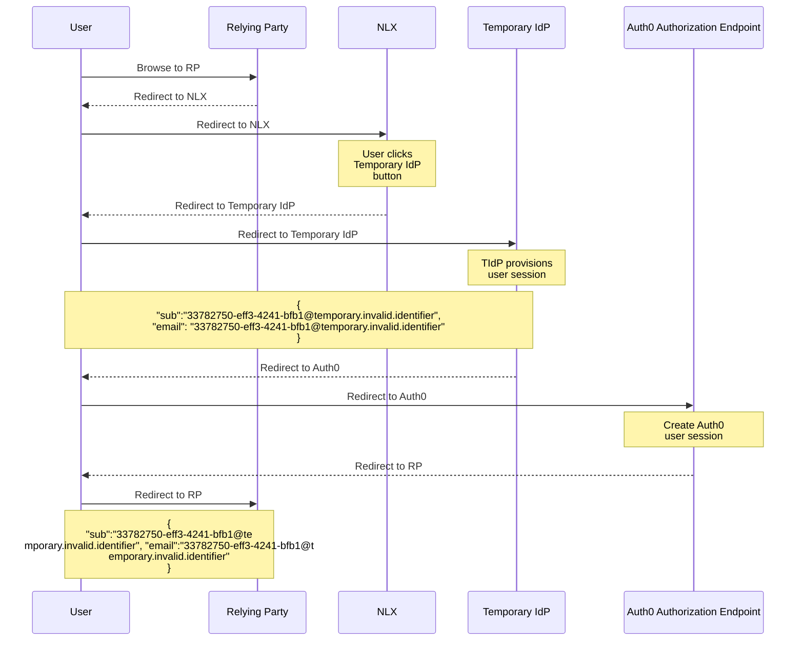
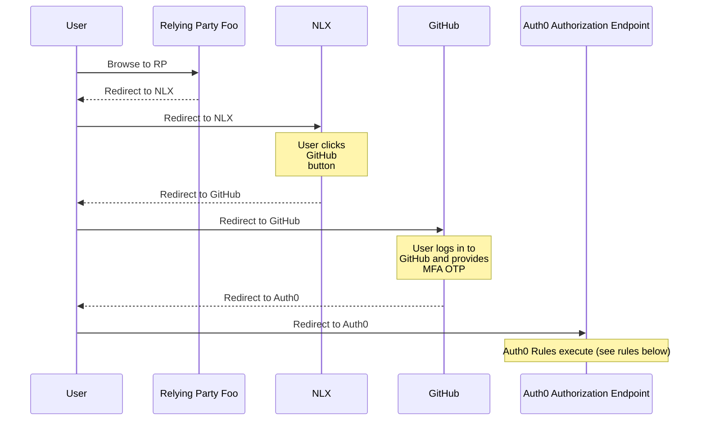
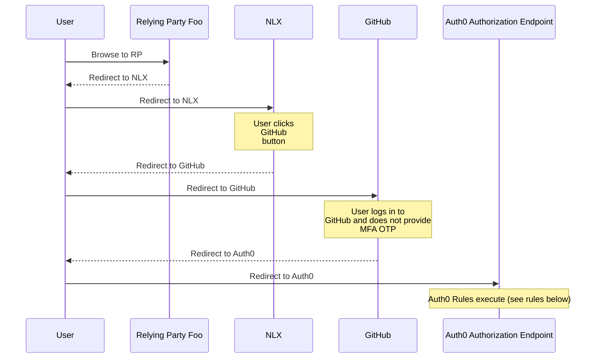
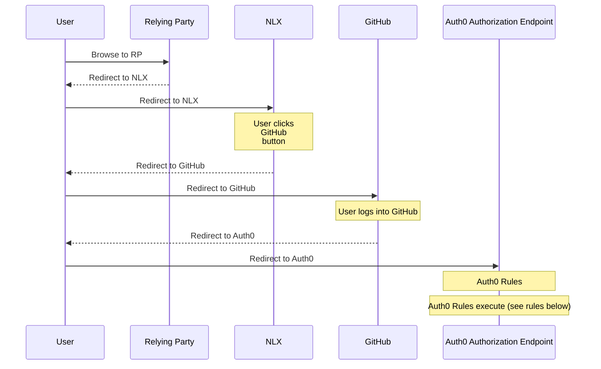
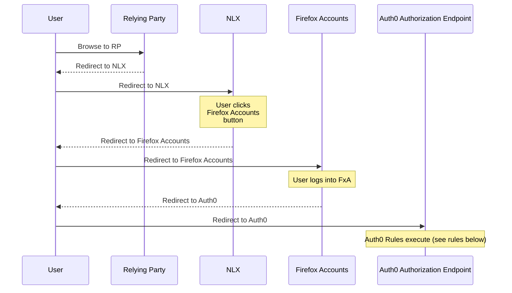

# Deratcheting user flows
## Table of contents

- [User logs in with Temporary IdP](#user-logs-in-with-temporary-idp)
- [User succeeds at logging into RP with AAL](#user-succeeds-at-logging-into-rp-with-aal)
- [User fails to log into RP with AAL](#user-fails-to-log-into-rp-with-aal)
- [Account linking](#account-linking)
    - [User logs in with the Mozilla IAM system for the first time](#user-logs-in-with-the-mozilla-iam-system-for-the-first-time)
    - [User logs in with second IdP for the first time](#user-logs-in-with-second-idp-for-the-first-time)
    - [User logs in with second IdP for a second time](#user-logs-in-with-second-idp-for-a-second-time)
    - [User logs in with third IdP and the first two are already linked](#user-logs-in-with-third-idp-and-the-first-two-are-already-linked)
    - [User logs in with third IdP for the first time and the other two are not linked](#user-logs-in-with-third-idp-for-the-first-time-and-the-other-two-are-not-linked)
    - [User logs in with third IdP that they've used before and the other two are not linked](#user-logs-in-with-third-idp-that-theyve-used-before-and-the-other-two-are-not-linked)

## User logs in with Temporary IdP

[Deratcheting Temporary IdP](../imgs/deratcheting_temporary_idp.png)

## User succeeds at logging into RP with AAL

[Deratcheting Login Success with AAL](../imgs/deratcheting_login_success_aal.png)

* Did GitHub report that the user has a registered MFA method with GitHub?
    * Yes
* Did GitHub report that the user's email address was verified?
    * Yes
* Read apps.yml and check for conformance
    * `apps.yml`

          Relying Party Foo:
            aal_required: AAL1
            expire_access_when_unused_for: 180 days
            authorized_groups: [mozilliansorg_nda]
    * Is this user a member of a group in the `authorized_groups` list
        * Yes
    * Has the user's access been revoked due to not having logged in for too many days (`180 days`)?
        * No
    * Is the AAL provided by this login (`AAL2`) sufficient based on the minimum AAL for this RP (`AAL1`)?
        * Yes
* Therefore allow the user into the RP
* User is redirected to the RP

## User fails to log into RP with AAL

[Deratcheting Login Failure with AAL](../imgs/deratcheting_login_failure_aal.png)

* Did GitHub report that the user has a registered MFA method with GitHub?
    * No
* Did GitHub report that the user's email address was verified?
    * Yes
* Read apps.yml and check for conformance
    * `apps.yml`

          Relying Party Foo:
            aal_required: AAL2
            expire_access_when_unused_for: 180 days
            authorized_groups: [mozilliansorg_nda]
    * Is this user a member of a group in the `authorized_groups` list?
        * Yes
    * Has the user's access been revoked due to not having logged in for too many days (`180 days`)?
        * No
    * Is the AAL provided by this login (`AAL1`) sufficient based on the minimum AAL for this RP (`AAL2`)?
        * No
* Therefore do not allow the user into the RP
* User is redirected to Error Unauthorized Page

## Account Linking

[Deratcheting Account Linking](../imgs/deratcheting_account_linking.png)

### User logs in with the Mozilla IAM system for the first time

This case would only occur for new users (users that have not used the Mozilla IAM system before the new deratcheting rules were active). This case would happen only once for a given user.

* GitHub returns profile of user to Auth0
    * `email=fulan@example.com`
* Auth0 creates a new profile for this new GitHub user. Now that this new 
  profile exists, searches for profiles done after this point in the rules will 
  return this brand new profile.
* Does the Auth0 profile contain any additional profiles in the `identities` 
  list indicating that the user's GitHub Auth0 profile is linked to something
    * No, the `identities` list contains only the GitHub profile
* Search for all user profiles in Auth0 where `email=fulan@example.com`
    * One result is returned, the user profile with `user_id` of 
      `github|123456` that was just now created when the user logged in
* Was one result returned?
    * Yes, allow the user to log in to the RP
    * `user_id` sent to the RP is `github|123456`

#### Test first login

1. Enable account linking
2. Log in with passwordless[1] with an account that's never logged in before
   and where nobody has logged in before with any IdP with an account with the
   same email address
3. User is logged in to the RP with the passwordless `user_id` and there is a
   single profile existing now with that user's email address and their 
   passwordless `user_id`

[1]: This could be any one of (passwordless, github, fxa, ldap) but we only need
     to test one of them

### User logs in with second IdP for the first time

This case would occur for old and new users (users that have and have not used 
the Mozilla IAM system before the new deratcheting rules were active). This case
would happen only once for a given user.

* GitHub returns profile of user to Auth0
    * `email=fulan@example.com`
* Auth0 creates a new profile for this new GitHub user. Now that this new 
  profile exists, searches for profiles done after this point in the rules will 
  return this brand new profile.
* Does the Auth0 profile contain any additional profiles in the `identities` 
  list indicating that the user's GitHub Auth0 profile is linked to something
    * No, the `identities` list contains only the GitHub profile
* Search for all user profiles in Auth0 where `email=fulan@example.com`
    * Two results are returned
        * `user_id=github|123456` : The profile that the user just now logged 
          in with
        * `user_id=ad|mozilla-ldap|fulan@example.com` : A preexisting LDAP 
          profile from when the user logged in before using an LDAP user with 
          the same email address as the GitHub user they just logged in with
* Was one result returned?
    * No, continue with the rules
* Are two results returned?
    * Yes
    * Call the `/api/v2/users/ad|mozilla-ldap|fulan@example.com/identities` 
      Auth0 endpoint to link the GitHub profile to whatever the other returned 
      profile is, in this case LDAP, and set it (LDAP) as primary
        * Pass this to the endpoint `{user_id: github|123456}`
    * Allow the user to log in to the RP
    * `user_id` sent to the RP is `ad|mozilla-ldap|fulan@example.com`

#### Test second IdP first time for new and old user

This section details two tests that depend on at which point account linking is
turned on (either in step 1 or step 4)

1. To test the "new user" scenario, enable account linking here
2. Log in with passwordless[1] with an account that's never logged in before
   and where nobody has logged in before with any IdP with an account with the
   same email address
3. User is logged in to the RP with the passwordless `user_id` and there is a
   single profile existing now with that user's email address and their 
   passwordless `user_id`
4. To test the "old user" scenario, enable account linking here
5. Log in with github[2] with a GitHub account that has the same email address
   configured as the one used above in the passwordless login but which has
   never logged in before
6. Auth0 rule links the second account, the GitHub account, to the now primary
   account, the passwordless account. 
7. User is logged in to the RP with the passwordless `user_id` and there is a
   single profile existing now with that user's email address and their 
   passwordless `user_id`. That profile has an `identities` array that contains
   the passwordless account as primary and the github account as non-primary

[1]: This could be any one of (passwordless, github, fxa, ldap) but we only need
     to test one of them

[2]: This could be any IdP other than the IdP used in step 2

### User logs in with second IdP for a second time

This case would occur for old and new users (users that have and have not used 
the Mozilla IAM system before the new deratcheting rules were active). This case
would happen very frequently, every time a user logs in with an IdP they've 
used before but which happens to not be their primary IdP.

* GitHub returns profile of user to Auth0
    * `email=fulan@example.com`
* Auth0 finds the existing profile for this existing GitHub user
* Does the Auth0 profile contain any additional profiles in the `identities` 
  list indicating that the user's GitHub Auth0 profile is linked to something
    * Yes, the `identities` list contains the GitHub profile and an LDAP profile
    * LDAP is primary because the `user_id` is 
      `ad|mozilla-ldap|fulan@example.com` not `github|123456`
    * Allow the user to login to the RP
    * `user_id` sent to the RP is `ad|mozilla-ldap|fulan@example.com`

#### Test second IdP second time for new and old user

1. Execute the steps in "Test second IdP first time for new and old user"
  * You only need follow the new or old users flows, not both
2. Log out of GitHub
3. Log in with github with the same GitHub account as you used above
4. User is logged in to the RP with the passwordless `user_id` and there is a
   single profile existing with that user's email address and their 
   passwordless `user_id`. That profile has an `identities` array that contains
   the passwordless account as primary and the github account as non-primary

### User logs in with third IdP and the first two are already linked

This case would occur as, over time, users use the Mozilla IAM system after 
these new deratcheting rules are in place and use IdPs they've never used 
before. This case would happen once each time a user uses a new IdP for the 
first time.

* GitHub returns profile of user to Auth0
    * `email=fulan@example.com`
* Auth0 creates a new profile for this new GitHub user. Now that this new 
  profile exists, searches for profiles done after this point in the rules 
  will return this brand new profile.
* Does the Auth0 profile contain any additional profiles in the `identities` 
  list indicating that the user's GitHub Auth0 profile is linked to something
    * No, the `identities` list contains only the GitHub profile
* Search for all user profiles in Auth0 where `email=fulan@example.com`
    * Two results are returned
        * `user_id=github|123456` : The profile that the user just now logged 
          in with
        * `user_id=ad|mozilla-ldap|fulan@example.com` : A preexisting LDAP 
          profile
            * This profile contains an `identities` list with two profiles, 
              indicating that the LDAP profile is linked to another profile
            * The other profile that is linked is `user_id=google-oauth2|789123`
* Was one result returned?
    * No, continue with the rules
* Are two results returned?
    * Yes
    * Call the `/api/v2/users/ad|mozilla-ldap|fulan@example.com/identities` 
      Auth0 endpoint to link the GitHub profile to whatever the other returned 
      profile is, in this case LDAP, and set it (LDAP) as primary
        * Pass this to the endpoint `{user_id: github|123456}`
    * The result is that now both the GitHub profile and the existing Google 
      profile are linked to the LDAP profile which is primary
    * Allow the user to login to the RP
    * `user_id` sent to the RP is `ad|mozilla-ldap|fulan@example.com`

#### Test third IdP with two already linked

1. Execute the steps in "Test second IdP first time for new and old user"
  * You only need follow the new or old users flows, not both
2. Log in with FxA[1] with a Firefox accounts user that has the same email
   address configured as the one used above in the passwordless  and GitHub 
   login but which has never logged in before
3. Auth0 rule links the third account, the FxA account, to the now primary
   account, the passwordless account. 
4. User is logged in to the RP with the passwordless `user_id` and there is a
   single profile existing with that user's email address and their 
   passwordless `user_id`. That profile has an `identities` array that contains
   the passwordless account as primary, the github account as non-primary and
   the FxA account as non-primary

[1]: This could be any IdP other than the two used in "Test second IdP first 
     time for new and old user"
     
### User logs in with third IdP for the first time and the other two are not linked

This case will be rare as the only users that trigger it would be existing 
users of the Mozilla IAM system logging in just after these new deratcheting 
rules become active with an IdP they've *never* used before. This would be 
unlikely but possible. This case would only ever happen once to a given user.

[Deratcheting Account Linking with third IdP](../imgs/deratcheting_account_linking_third_idp.png)

* Firefox Accounts returns profile of user to Auth0
    * `email=fulan@example.com`
* Auth0 creates a new profile for this new Firefox accounts user. Now that this 
  new profile exists, searches for profiles done after this point in the rules 
  will return this brand new profile.
* Does the Auth0 profile contain any additional profiles in the `identities` 
  list indicating that the user's Firefox Accounts Auth0 profile is linked to 
  something
    * No, the `identities` list contains only the Firefox Accounts profile
* Search for all user profiles in Auth0 where `email=fulan@example.com`
    * Three results are returned
        * `user_id=oauth2|firefox-accounts|456123` : The profile that the user 
          just now logged in with
        * `user_id=github|123456` : A preexisting GitHub profile
        * `google-oauth2|789123` : A preexisting Google profile
* Was one result returned?
    * No, continue with the rules
* Are two results returned?
    * No, continue with the rules
* Are greater than two results returned?
    * Yes
    * Is the creation date of the Firefox Accounts profile, the one the user 
      just logged in with, within the last 5 minutes?
        * Yes
        * This indicates that this is the first time this user has ever logged 
          in with Firefox Accounts
        * Therefore, exclude Firefox Accounts from the logic which decides what 
          the primary IdP is
        * Of the other IdPs returned, which one is the at the top of the 
          "ratcheting model"
            * The model is LDAP > Firefox Accounts > GitHub > Google > 
              Passwordless
            * GitHub > Google : therefore the primary IdP should be GitHub
            * Note : This means that even though Firefox Accounts is higher in 
              the ratcheting model than GitHub, because the user has never used 
              it before, it is disregarded.
        * Call the `/api/v2/users/github|123456/identities` Auth0 endpoint to 
          link the Firefox Accounts profile to the profile determined to be the 
          primary via ratcheting, in this case GitHub, and set it (GitHub) as 
          primary
            * Pass this to the endpoint 
              `{user_id: oauth2|firefox-accounts|456123}`
        * Call the `/api/v2/users/github|123456/identities` Auth0 endpoint to 
          link the Google profile to the profile determined to be the primary 
          via ratcheting, in this case GitHub, and set it (GitHub) as primary
            * Pass this to the endpoint `{user_id: google-oauth2|789123}`
        * Allow the user to login to the RP
            * `user_id` sent to the RP is `github|123456`

#### Test primary third IdP with two not linked

1. Log in with passwordless[1] with an account that's never logged in before
   and where nobody has logged in before with any IdP with an account with the
   same email address
2. User is logged in to the RP with the passwordless `user_id` and there is a
   single profile existing now with that user's email address and their 
   passwordless `user_id`
3. Log in with github[2] with a GitHub account that has the same email address
   configured as the one used above in the passwordless login but which has
   never logged in before
4. User is logged in to the RP with the github `user_id` and there is a
   second profile existing now with that user's email address and their 
   github `user_id`
5. Enable account linking
6. Log in with FxA[3] with a Firefox accounts user that has the same email
   address configured as the one used above in the passwordless and GitHub 
   login but which has never logged in before
7. Auth0 rule determines what account should be primary using ratcheting logic.
   It compares FxA, GitHub and Passwordless and decides that FxA should be
   primary. The rule links nothing because primary is FxA and we're logging in
   with FxA 
8. User is logged in to the RP with the FxA `user_id` and there is a
   profile existing now with that user's email address and their FxA `user_id`.
   That profile has an `identities` array that contains only the FxA account as
   primary.

[1]: This could be any one of (passwordless, github, fxa, ldap) but we only need
     to test one of them

[2]: This could be any IdP other than the IdP used in step 1

[3]: This could be any IdP other than the IdP used in step 1 or step 3

#### Test non-primary third IdP with two not linked

1. Log in with passwordless[1] with an account that's never logged in before
   and where nobody has logged in before with any IdP with an account with the
   same email address
2. User is logged in to the RP with the passwordless `user_id` and there is a
   single profile existing now with that user's email address and their 
   passwordless `user_id`
3. Log in with FxA[2] with a Firefox accounts user that has the same email
   address configured as the one used above in the passwordless but which has
   never logged in before
4. User is logged in to the RP with the FxA `user_id` and there is a
   second profile existing now with that user's email address and their 
   FxA `user_id`
5. Enable account linking
6. Log in with github[3] with a GitHub account that has the same email address
   configured as the one used above in the passwordless login and FxA login but 
   which has never logged in before
7. Auth0 rule determines what account should be primary using ratcheting logic.
   It compares FxA, GitHub and Passwordless and decides that FxA should be
   primary. The rule links the the GitHub account, to the primary account,
   the FxA account. The Passwordless account remains unlinked to anything. 
8. User is logged in to the RP with the FxA `user_id` and there is a
   profile existing now with that user's email address and their FxA `user_id`.
   That profile has an `identities` array that contains the FxA account as
   primary and the GitHub account as non-primary.

[1]: This could be any one of (passwordless, github, fxa, ldap) but we only need
     to test one of them

[2]: This could be any IdP other than the IdP used in step 1

[3]: This could be any IdP other than the IdP used in step 1 or step 3 which has
     a lower [matchOrder](https://github.com/mozilla-iam/auth0-deploy/blob/847ff5f99fd3c1d48f9ed1a0b933ae21cbebe66e/rules/force-users-login-most-secure-method.js#L49-L53)
     than either the Idp used in step 1 or step 3 or both.

### User logs in with third IdP that they've used before and the other two are not linked

This case will be most common for existing users of the Mozilla IAM system 
logging in just after these new deratcheting rules become active. Most users
will have multiple pre-existing Auth0 profiles from different IdPs and they will
trigger this flow the first time they login *after* the new deratcheting rules 
are active. This case will only ever happen once for any given user.

* Firefox Accounts returns profile of user to Auth0
    * `email=fulan@example.com`
* Auth0 finds the existing profile for this existing Firefox Accounts user
* Does the Auth0 profile contain any additional profiles in the `identities` 
  list indicating that the user's Firefox Accounts Auth0 profile is linked to 
  something
    * No, the `identities` list contains only the Firefox Accounts profile
* Search for all user profiles in Auth0 where `email=fulan@example.com`
    * Three results are returned
        * `user_id=oauth2|firefox-accounts|456123` : The profile that the user 
          just now logged in with
        * `user_id=github|123456` : A preexisting GitHub profile
        * `google-oauth2|789123` : A preexisting Google profile
* Was one result returned?
    * No, continue with the rules
* Are two results returned?
    * No, continue with the rules
* Are greater than two results returned?
    * Yes
    * Is the creation date of the Firefox Accounts profile, the one the user 
      just logged in with, within the last 5 minutes?
        * No
        * Therefore, include Firefox Accounts in the logic which decides what 
          the primary IdP is
        * Of the IdPs returned, which one is the at the top of the "ratcheting 
          model"
            * The model is LDAP > Firefox Accounts > GitHub > Google > 
              Passwordless
            * Firefox Accounts > GitHub > Google : therefore the primary IdP 
              should be Firefox Accounts
        * Call the `/api/v2/users/oauth2|firefox-accounts|456123/identities` 
          Auth0 endpoint to link the GitHub profile to the profile determined 
          to be the primary via ratcheting, in this case Firefox Accounts, and 
          set it (Firefox Accounts) as primary
            * Pass this to the endpoint `{user_id: github|123456}`
        * Call the `/api/v2/users/oauth2|firefox-accounts|456123/identities` 
          Auth0 endpoint to link the Google profile to the profile determined to
          be the primary via ratcheting, in this case Firefox Accounts, and set 
          it (Firefox Accounts) as primary
            * Pass this to the endpoint `{user_id: google-oauth2|789123}`
        * Allow the user to login to the RP
            * `user_id` sent to the RP is `oauth2|firefox-accounts|456123`

#### Test third IdP used before with two not linked

1. Log in with passwordless[1] with an account that's never logged in before
   and where nobody has logged in before with any IdP with an account with the
   same email address
2. User is logged in to the RP with the passwordless `user_id` and there is a
   single profile existing now with that user's email address and their 
   passwordless `user_id`
3. Log in with FxA[2] with a Firefox accounts user that has the same email
   address configured as the one used above in the passwordless but which has
   never logged in before
4. User is logged in to the RP with the FxA `user_id` and there is a
   second profile existing now with that user's email address and their 
   FxA `user_id`
5. Enable account linking
6. Log in with github[3] with a GitHub account that has the same email address
   configured as the one used above in the passwordless login and FxA login but 
   which has never logged in before
7. Auth0 rule determines what account should be primary using ratcheting logic.
   It compares FxA, GitHub and Passwordless and decides that FxA should be
   primary. The rule links the the GitHub account, to the primary account,
   the FxA account. The Passwordless account remains unlinked to anything. 
8. User is logged in to the RP with the FxA `user_id` and there is a
   profile existing now with that user's email address and their FxA `user_id`.
   That profile has an `identities` array that contains the FxA account as
   primary and the GitHub account as non-primary.

[1]: This could be any one of (passwordless, github, fxa, ldap) but we only need
     to test one of them

[2]: This could be any IdP other than the IdP used in step 1

[3]: This could be any IdP other than the IdP used in step 1 or step 3 which has
     a lower [matchOrder](https://github.com/mozilla-iam/auth0-deploy/blob/847ff5f99fd3c1d48f9ed1a0b933ae21cbebe66e/rules/force-users-login-most-secure-method.js#L49-L53)
     than either the Idp used in step 1 or step 3 or both.
